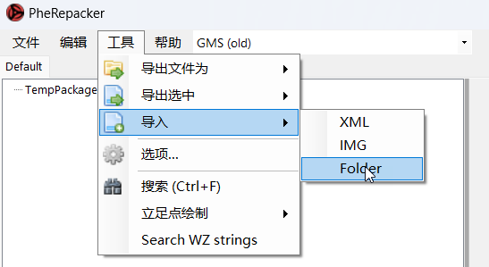
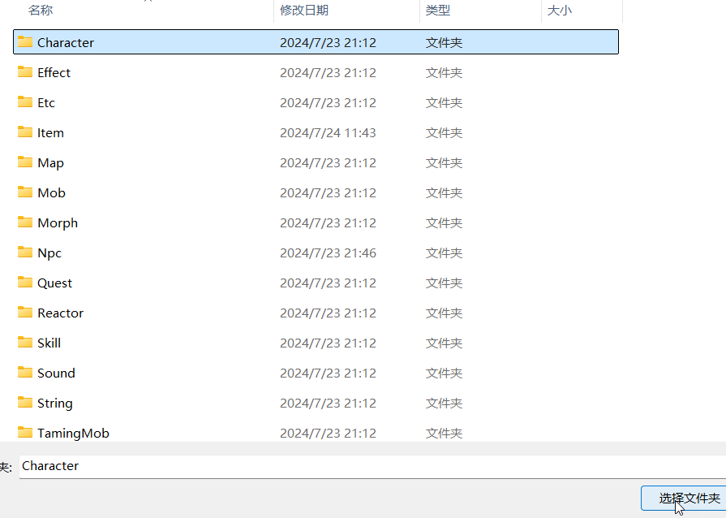
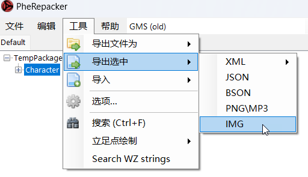

# BeiDou-Client
北斗客户端

## 关于
该仓库主要目的是为了大家共同维护 Data 目录而设

## 使用方法
先把仓库Clone到本地

```shell
git clone https://github.com/leevccc/BeiDou-Client
```

## 特制版 HaSui

**以下方法均仅供参考，如果你有更舒服的打开方式，就按你的来。**

下载并使用特制版的 [HaSuite](https://github.com/Arnuh/HaSuite/releases)

### 如何导入

打开项目目录下的TempPackage.wz（一个空wz为了方便大家使用）

选中 TempPackage.wz —— 工具 —— 导入 —— Folder


选中你要导入的文件夹，点击 选择文件夹，不嫌慢的话也可以导入整个Data目录


### 如何导出

修改完以后，先把TempPackage.wz保存一遍，另外找个地方保存，不要覆盖原文件（如果不保存直接导出会报错！！！）

选中你要导出的目录 —— 工具 —— 导出选中 —— IMG


选择对应的目录即可，比如图中要导出的Character在Data目录下，那导出目录就选Data即可。

最后清理掉那个临时保存的 TempPackage.wz